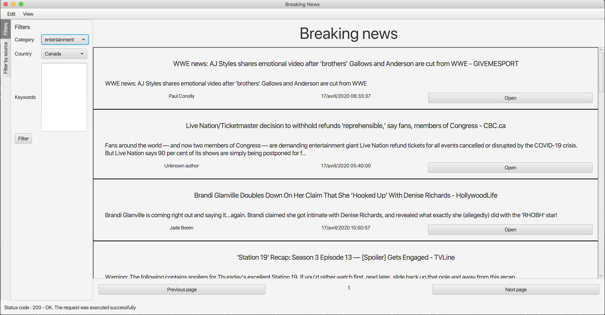
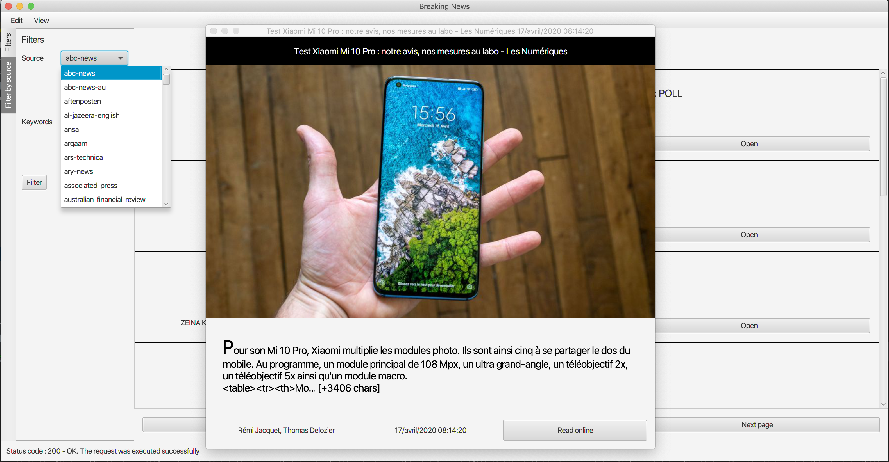
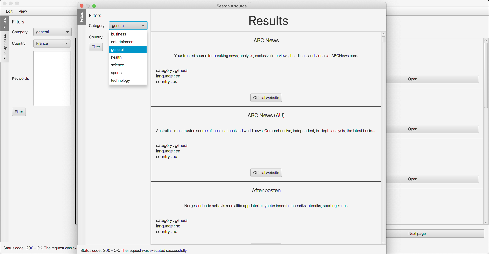

# Newstorm

A cross-platform tornadofx based kotlin application to check breaking news
using [newsapi](https://newsapi.org/v2/) REST api

## context

This project was given by my lecturer in kotlin development
at the [ISEN Toulon](https://www.isen.fr/) engineering school.

## Presentation

The goal is to provide a graphical application for [newsapi](https://newsapi.org/v2/) REST api.

## Screenshots

window when the user read an article

window when the user search for a specific source

## Contribution

### development

see TODO.txt for the features to implement
send me an email to be added in the [Trello](https://trello.com/davidhaioum/boards) team

### report a bug

kindly send me an email at the address provided in AUTHORS.txt